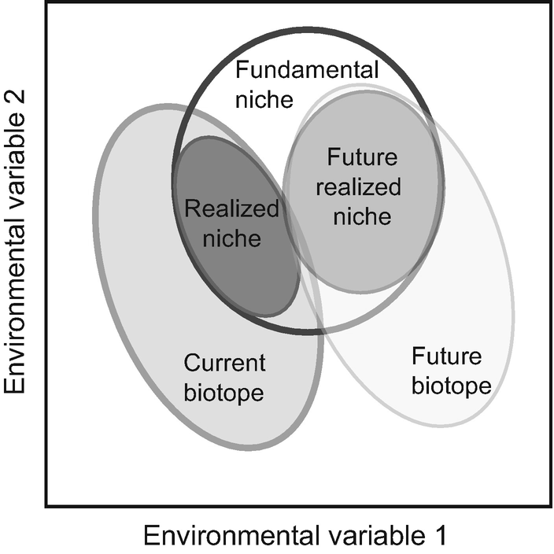
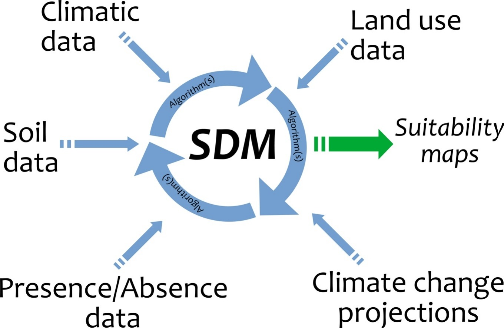
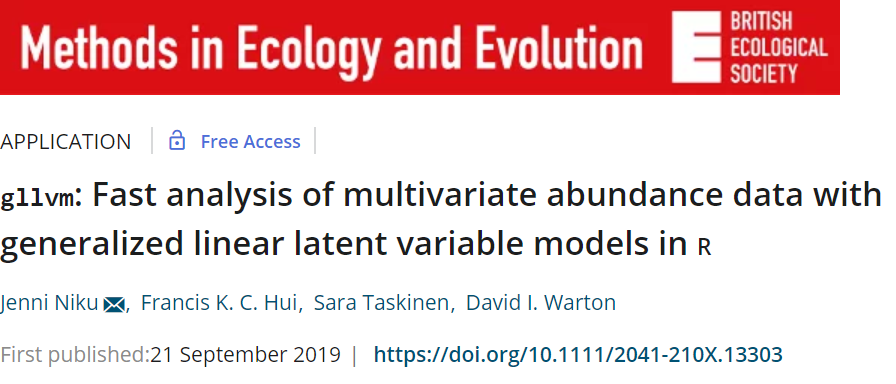
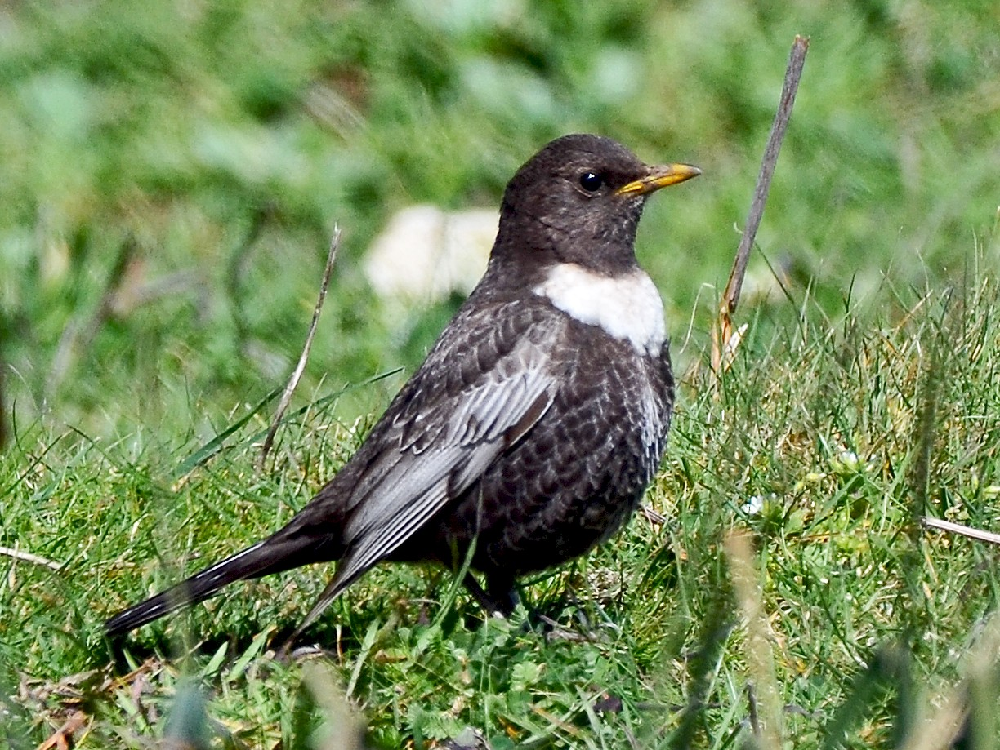

```{r setup, include=FALSE, echo=F}
# - \usetheme[style=ntnu|simple|vertical|horizontal, language=bm|nn|en, smalltitle, city=all|trondheim|alesund|gjovik]{ntnu2017}
 
knitr::opts_chunk$set(echo = FALSE, message=F, warning=F)
#{.slide: text-align="left"}
#{.slide: class="left"}
# data-background=#F0F1EB
library(fields)
library(jpeg)
library(ggplot2)
library(vegan)
library(viridis)
library(knitr)
library(gllvm)
load("mod.RData")
```

This is some documentation of the presentation I gave at the Center for Biodiversity Dynamids (CBD) on 04-02-2020, on the use of the [gllvm](Niku et al. 2019) package to fit Joint Species Distribution Models (JSDMs) in R. My goal is not to ecologically interpret the results, for this see the publication by Damaris Zurell. Here, I intend to give a short overview of the functionality available in the \textit{gllvm} package, as it provides a easy-to-use interface to fast estimation for JSDMs.

The example presented below was first worked out by Damaris Zurell [see SDM-intro](https://damariszurell.github.io/SDM-Intro/), see also [Zurell et al. 2019: Testing species assemblage predictions from stacked and joint species distribution models](https://onlinelibrary.wiley.com/doi/full/10.1111/jbi.13608) whose work I built on here.

Feel free to contact me at [bert.vanderveen@nibio.no](mailto:bert.vanderveen@nibio.no) or [@vdVeenB](https://twitter.com/vdVeenB) if you have any questions.

# Species distributions and niches
The \textit{current biotope} and \textit{future biotope} in figure one represent the available environment in the wide, wide world.

Species have a fundamental niche that represents the space it can theoretically occur at, which is a subspace of the available environment. All space outside of the fundamental niche is unsuited for a species to occur at. The realized niche is a subspace of the fundamental niche, which represents the space a species occurs at in practice. This is different from the fundamental niche due to e.g. the colonisation history and dispersal abilities of species, and the effects if species interactions.

Figure one nicely represents our general goal when fitting distributions models: estimating the niche of species in the light of environmental change (in space and/or time).

```{r, fig.width=5, fig.cap="Fig. 1: Fletcher and Fortin 2019"}

```

## Joint responses
Figure one represents a single species scenario. The axes, though dubbed "environmental variable", also represent interactions with other species, as it affects a species' tolerance to the environment. In the case of quadratic niches (alternatively one might consider them skewed), figure two and three demonstrate potential impacts of environmental change on species occurrences.

```{r, warning=F, message = F, fig.width=5, fig.height=3, fig.cap="Fig. 2: Species are often assumed to exhibit quadratic responses on the environment"}
par(mar = c(2,2,0,0))
plot(NA, xlim=c(-3.65,10), ylim=c(0,.8), axes=F, ylab="",xlab="")
curve(dnorm(x, mean=0,sd=1), -3, 3,lwd=2, xlab = "", ylab = "",add=T, col="black")
curve(dnorm(x, mean=6,sd=0.5), 4, 8,lwd=2, xlab = "", ylab = "",add=T, col="black",lty="dashed")
curve(dnorm(x, mean=3,sd=1.2), -1, 7,lwd=2, xlab = "", ylab = "",add=T, col="black",lty="dotted")

mtext(text = "Environment", side= 1, cex = 2)
arrows(x0=-3.5, y0=0, x1=10, y1=0,length=.2, lwd=2)
arrows(x0=-3.5, y0=0, x1=-3.5, y1=.8,length=.2, lwd=2)
mtext(text = "Abundance", side= 2, cex = 2)
```

Multiple species occurring in the same environment will seggregate their niches, following the competitive exclusion principle. When the environment changes, and one species disappears due to e.g. local extinction, another species might be able to expand its realized niche. In that scenario, species interactions will change.

## Environmental change
```{r, warning=F, message = F, fig.width=5, fig.height=3, fig.cap="Fig. 3: If one species disappears (compared to Fig. 2), another might be able to expand its niche, potentially affecting other species"}
par(mar = c(2,2,0,0))
plot(NA, xlim=c(-3.65,10), ylim=c(0,.8), axes=F, ylab="",xlab="")
curve(dnorm(x, mean=0,sd=1), -3, 3,lwd=2, xlab = "", ylab = "",add=T, col="black")
curve(dnorm(x, mean=1,sd=2), -3.5, 8,lwd=2, xlab = "", ylab = "",add=T, col="black",lty="dashed")

mtext(text = "Environment", side= 1, cex = 2)
arrows(x0=-3.5, y0=0, x1=10, y1=0,length=.2, lwd=2)
arrows(x0=-3.5, y0=0, x1=-3.5, y1=.8,length=.2, lwd=2)
mtext(text = "Abundance", side= 2, cex = 2)
```

# Species Distribution Modelling (SDM)
Species Distribution Models operate under the ecological framework mentioned above. Most commonly, methods such as Generalized Linear (Mixed-effects) Models (GLMM) or approaches such as [Maxent](https://www.sciencedirect.com/science/article/pii/S030438000500267X?via%3Dihub) or Regression [trees](https://cran.r-project.org/web/packages/tree/tree.pdf) are used to predict species occurrence/abundance to predict species distributions in space and/or time as a function of environmental covariates. The shape of environmental covariates (e.g. quadratic or different) may be inferred by model selection, or by using an approach like Generalized Additive Models (GAMs).

After finding the best model fit, predictions can be made onto maps and the potential for future change in distributions can be predicted from climate scenarios.

```{r, fig.cap="Fig. 4: A SDM workflow, by Pecchi et al. 2019"}

```

SDMs are fit for each species individually. Modelling multiple species is done through stacked species distribution models [SSDM](https://cran.r-project.org/web/packages/SSDM/vignettes/SSDM.html) or joint models, see below and e.g. [mvabund](https://besjournals.onlinelibrary.wiley.com/doi/10.1111/j.2041-210X.2012.00190.x).

# Generalized Linear Latent Variable models (GLLVMs)
Generalized Linear Latent Variable Models (GLLVMs) are a class of factor analytic models that are used for the joint modelling of species distributions (JSDMs) which can alternatively be understood as model-based ordination [(Hui et al. 2015)](https://besjournals.onlinelibrary.wiley.com/doi/10.1111/2041-210X.12236).

The log-likelihood is given by the equation:

\begin{equation}
\log\mathcal{L}(\Theta) =\sum \limits_{i=1}^n \ln\Bigg( \displaystyle\int \prod \limits_{j=1}^p f(y_{ij} | \boldsymbol{z}_i, \Theta)h(\boldsymbol{z}_i) d\boldsymbol{z}_i \Bigg)
\end{equation}

 * $\Theta$ all parameters
 * $y_{ij}$ matrix of data (n sites by p species)
 * $\boldsymbol{z}_i$ latent variables (missing covariate, random-effect, ordination axis)
 * Essentialy a multivariate mixed-effects model [(Warton et al. 2015)](https://www.sciencedirect.com/science/article/pii/S0169534715002402?via%3Dihub)

Fitting GLLVMs can be computationally intensive due to the presence of latent variables. Various Bayesian frameworks are available in R to fit this type of model using Markov-Chain Montecarlo (MCMC) techniques, e.g. [JAGS](http://mcmc-jags.sourceforge.net/), [STAN](https://mc-stan.org/rstan/), [NIMBLE](https://r-nimble.org/) or [greta](https://greta-stats.org/) can be used as well as the Hierarchical Modelling of Species Communities [HMSC](https://besjournals.onlinelibrary.wiley.com/doi/full/10.1111/2041-210X.13345) package.

However, MCMC can be take a long time to converge. As a fast alternative, Niku et al. (2019) have developed an approach in frequentist statistics, based on approximation of the marginal GLLVM likelihood. The approach is subject to local optima in the likelihood, thus the starting values (specifically for the latent variables) have to be carefully considered [(Niku et al. 2019)](https://besjournals.onlinelibrary.wiley.com/doi/full/10.1111/2041-210X.13303). 

# Fast analysis of multivariate abundance data
GLLVMs fit with either the Laplace approximation (LA) or Variational approximation (VA) are a fast alternative to fitting JSDMs wth MCMC. Niku et al. (2019) mentions an example in which they experienced a 150x speed-up compared to the \textit{boral} package which utilizes JAGS.



The approach from Niku et al. (2019) is implemented in the \textit{gllvm} package, for which I will demonstrate the use below.

* Variational approximation: [Hui et al. 2017](https://www.tandfonline.com/doi/abs/10.1080/10618600.2016.1164708); van der Veen et al. in prep
  + Pro: very fast
  + Con: requires unique maths for each case
* Laplace approximation: [Huber et al. 2004](https://rss.onlinelibrary.wiley.com/doi/abs/10.1111/j.1467-9868.2004.05627.x); [Niku et al. 2017](https://link.springer.com/article/10.1007%2Fs13253-017-0304-7)
  + Pro: very fast, same form for all cases
  + Con: not as flexible as VA, slower than VA in discrete cases
* Approximate methods are affected by local optima in the likelihood

## Computational voodoo by Template model builder
\textit{Kristensen, K., Nielsen, A., Berg, C.W., Skaug, H., Bell, B. (2016) TMB: Automatic Differentiation and Laplace Approximation}

The package uses Template Model Builder [(TMB)](https://kaskr.github.io/adcomp/Introduction.html) for the computational implementation. TMB is a convenient framework to automatically apply the laplace approximation and/or automatic differentiation of likelihood functions coded in C++. It allows to peform completely parallelizable optimization, which is still difficult with MCMC (though see parallel bugs). It combines very well with Variational Approximation.

* TMB is aperforms automatic differentiation and laplace approximation
* Supports a range of probability distributions and model types
* Optimization is performed in R (in parallel)
* It does require coding the likelihood in C++

## Current functionality

Most of the functions currently available in the \textit{gllvm} package.

- [gllvm](https://www.rdocumentation.org/packages/gllvm/versions/1.2.1): main function to run a model
- [anova](https://www.rdocumentation.org/packages/gllvm/versions/1.2.1/topics/anova.gllvm): analysis of variance for multiple models
- [coefplot](https://www.rdocumentation.org/packages/gllvm/versions/1.2.1/topics/coefplot.gllvm): plot coefficients of fixed-effects
- [residuals](https://www.rdocumentation.org/packages/gllvm/versions/1.2.1/topics/residuals.gllvm): calculates dunn-smyth residuals
- [summary](https://www.rdocumentation.org/packages/gllvm/versions/1.2.1/topics/summary.gllvm)
- [ordiplot](?gllvm::ordiplot): biplot of latent effect
- [plot](https://www.rdocumentation.org/packages/gllvm/versions/1.2.1/topics/plot.gllvm): residual plots
- [confint](https://www.rdocumentation.org/packages/gllvm/versions/1.2.1/topics/confint.gllvm): calculates confidence intervals
- [predict](https://www.rdocumentation.org/packages/gllvm/versions/1.2.1/topics/predict.gllvm)
- [predictLVs](https://www.rdocumentation.org/packages/gllvm/versions/1.2.1/topics/predictLVs.gllvm)
- [getResidualCov](https://www.rdocumentation.org/packages/gllvm/versions/1.2.1/topics/getResidualCov.gllvm)
  [getResidualCor](https://www.rdocumentation.org/packages/gllvm/versions/1.2.1/topics/getResidualCor.gllvm): get the residual covariance or correlation matrix (association matrix)
- [getPredictErr](https://www.rdocumentation.org/packages/gllvm/versions/1.2.1/topics/getPredictErr.gllvm): prediction error for site scores (latent variable)
- [Simulate](https://www.rdocumentation.org/packages/gllvm/versions/1.2.1/topics/simulate.gllvm)
- [randomCoefPlot](https://www.rdocumentation.org/packages/gllvm/versions/1.2.1/topics/randomCoefplot.gllvm): plot random coefficients for fourth corner model (if so specified)

A vignette for the package is available [here](https://jenniniku.github.io/gllvm/), with example code and datasets. 

Note that the model can be run without covariates, but this is not necessarily an intercept-only model as latent variables can still be included.

It is important to spend some time running the model with different settings, specifically the starting values. Though <code>starting.values = TRUE</code> often performs well, it is advisable to use <code>starting.values = "res"</code> in combination with <code>jitter.var = 0.2</code> and <code>n.init >1</code> (e.g. 3) to find the best fit (see Niku et al. (2019) for suggestions for suggestions).
 
```{r echo=T, eval=F, size="tiny"}
# Fitting the model
library(gllvm)
mod <- gllvm(formula=Y~X+I(X^2),
             num.lv = 2, 
             row.eff = FALSE,
             dependent.row = FALSE,
             offset = NULL,
             family = "binomial", 
             method="VA",
             optimizer="optim",
             starting.val = "zero",
             n.init = 1,
             maxit = 10000, 
             sd.errors = F)
```

After running the model, one should check residual plots. Since deviance/ pearson residuals cannot necessarily be expected to be normally distributed for latent effects models (so including GLMMs), the package provides randomized quantile residuals [(Dunn and Smyth 1996)](https://www.jstor.org/stable/1390802?seq=1). As in residual plots for linear models, look for any patterns and outliers. The plots in figure five look good. If residual plots don't look well:

1) Change probability distribution if not appropriate
2) Diagnose (and potentially exclude) outliers
3) Add covariates
4) Add more latent variables

```{r, out.width="50%"}
plot(mod,which=1)
```

```{r, out.width="50%"}
plot(mod,which=2)
```

```{r, out.width="50%"}
plot(mod,which=3)
```


```{r, out.width="50%"}
plot(mod,which=4)
```

```{r, out.width="50%", fig.cap="Fig. 5: Randomized quantile residual plots"}
plot(mod,which=5)
```

The package offers various ways to visualize the results from the model. For fixed-effects, the <code>coefplot</code> function is useful to find which covariates have most effects for what species (note that this does require standard errors to be calculated).

```{r}
coefplot(mod, which.Xcoef=1:3)
```

```{r, fig.cap="Fig. 6: Fixed-effects coefficient plots. Coefficients of which the confidence interval crosses zero are automatically greyed out"}
coefplot(mod, which.Xcoef=4:6)
```

As with all GLLVMs, the residual correlation matrix (species association matrix) can be visualized using the [corrplot](https://cran.r-project.org/web/packages/corrplot/vignettes/corrplot-intro.html) package.

```{r, fig.cap="Fig. 7: Residual correlation plot for the Swiss forest birds dataset below"}
library(corrplot)
corrplot(getResidualCor(mod),type="lower",method="color",order="FPC")
```

<!-- ## 1D Optiplot -->
<!-- ```{r} -->
<!-- optfunc<-function(x,mod,which.lvs,spp){ -->
<!--   mod$params$beta0[spp]+x*(-mod$params$theta[spp,which.lvs]/(2*(1/sqrt(-2*-1))))+x^2*-1 -->
<!-- } -->
<!-- curve(optfunc(x,mod,2,1),xlab="Latent variable 2", ylab="Prediction", ylim=c(-10,5),xlim=c(-4,4))#might have to change these, will have to see -->
<!-- for(i in 1:ncol(Y)){ -->
<!--   curve(optfunc(x,mod,2,i),xlab="Latent variable 2", ylab="Prediction", add=T,col=i) -->
<!-- } -->
<!-- ``` -->

For users that are more interested in the ordination perspective, rather than the JSDM perspective on these models, the package offers the <code>ordiplot</code> function, which constructs biplots of the site scores and species scores. Unlike in classical ordination, this function offers the possibility to visualize prediction regions for the site scores.

```{r, fig.cap="Fig. 8: Biplot of latent effect for the Swiss forest bird example"}
gllvm::ordiplot(mod,s.colors = "lightgrey",biplot=T)
```

# Example: Swiss forest birds
The example included here uses the data probided by Zurell et al. (2019) on [Dryad](https://datadryad.org/stash/dataset/doi:10.5061/dryad.k88v330). Originally, the modal was fit using [boral](https://besjournals.onlinelibrary.wiley.com/doi/full/10.1111/2041-210X.12514) The data is from the Swiss orthinological institute. Species with less than 50 presences were removed, resulting in a dataset including 56 species at more than 2500 locations.

```{r, fig.cap="Table 1. Names of species included in the dataset"}
library(kableExtra)
avi_dat <- read.csv('Data_SwissBreedingBirds.csv')
Y <- as.matrix(avi_dat[,1:56])

tab<-kable(matrix(sort(gsub("_"," ", colnames(Y))),ncol=4))
#kable_styling(tab,font_size = 5)
```

Though the best model in the original publication included five covariates, I've decided to only include three here.

```{r, include=F}
X <- avi_dat[,57:ncol(avi_dat)]
X3<-scale(avi_dat[,c('bio_5', 'bio_2', 'bio_14')])

#https://damariszurell.github.io/SDM-Intro/
#prepare map
library(raster)
#mod<-gllvm(formula = Y ~ X3 + I(X3^2), num.lv = 2, family = "binomial", 
          # sd.errors = T, maxit = 10000, starting.val = "zero")
# Please note that you have to set download=T if you haven't downloaded the data before:
bio_curr <- getData('worldclim', var='bio', res=0.5, lon=5.5, lat=45.5, path="maps",download=F)[[c(2,5,14)]]
# Please note that you have to set download=T if you haven't downloaded the data before:
bio_fut <- getData('CMIP5', var='bio', res=0.5, lon=5.5, lat=45.5, rcp=45, model='NO', year=50, download=F, path="maps")[[c(2,5,14)]]

bg <- raster('/vsicurl/https://damariszurell.github.io/SDM-Intro/CH_mask.tif')

ch_ext <- c(5, 11, 45, 48)

bio_curr <- crop(bio_curr, ch_ext)
bio_curr <- projectRaster(bio_curr, bg)
bio_curr <- resample(bio_curr, bg)
bio_curr <- mask(bio_curr, bg)
names(bio_curr) <- c('bio_2', 'bio_5', 'bio_14')
bio_curr[[1]] <- bio_curr[[1]]/10
bio_curr[[2]] <- bio_curr[[2]]/10

bio_fut <- crop(bio_fut, ch_ext)
bio_fut <- projectRaster(bio_fut, bg)
bio_fut <- resample(bio_fut, bg)
bio_fut <- mask(bio_fut, bg)
names(bio_fut) <- c('bio_2', 'bio_5', 'bio_14')

bio_fut[[1]] <- bio_fut[[1]]/10
bio_fut[[2]] <- bio_fut[[2]]/10

#standardize environmental variables
scale_attrib <- attributes(scale(avi_dat[,c('bio_2', 'bio_5', 'bio_14')]))

values(bio_curr) <- scale(values(bio_curr),center = scale_attrib$`scaled:center`[names(bio_curr)], scale = scale_attrib$`scaled:scale`[names(bio_curr)])

values(bio_fut) <- scale(values(bio_fut),center = scale_attrib$`scaled:center`[names(bio_fut)], scale = scale_attrib$`scaled:scale`[names(bio_fut)])

#fit model
#mod <- gllvm(formula=Y~X3+I(X3^2),maxit=10000,family="binomial",sd.errors=T,num.lv=2,starting.val="zero")

#predictions 
bio_curr_df <- data.frame(rasterToPoints(bio_curr))[,1:5]
pred <- sweep(as.matrix(cbind(bio_curr_df[,-c(1,2)],bio_curr_df[,-c(1,2)]^2))%*%t(mod$params$Xcoef),2,mod$params$beta0,"+")
pred <- pnorm(pred)
bio_curr_df<- cbind(bio_curr_df,pred)


# Make raster stack of predictions:
r_pred_curr <- rasterFromXYZ(bio_curr_df[,-c(3:5)])

#into the future

#predictions 
bio_curr_df_fu <- data.frame(rasterToPoints(bio_fut))
pred <- sweep(as.matrix(cbind(bio_curr_df_fu[,-c(1,2)],bio_curr_df_fu[,-c(1,2)]^2))%*%t(mod$params$Xcoef),2,mod$params$beta0,"+")
pred <- pnorm(pred)
bio_curr_df_fu<- cbind(bio_curr_df_fu,pred)

# Make raster stack of predictions:
r_pred_fu <- rasterFromXYZ(bio_curr_df_fu[,-c(3:5)])

```

```{r, echo=F, fig.cap="Fig. 9: Covariates included in the model"}

names(bio_curr) <- c("Max temperature warmest month","Mean diurnal temperature range", "Precipitation of driest month")
plot(bio_curr)
names(bio_curr) <- c("bio_2","bio_5","bio_14")
```

## The model

The \textit{gllvm} package currently only fits models with linear latent variables, and exclusively spatial, so our linear predictor is:

$\eta_{ij} = \beta_{0j} + \boldsymbol{X}_i^\top \boldsymbol{\beta}_j + \boldsymbol{z}_i^\top \boldsymbol{u}_j$


Above, $\beta_{0j}$ is a species-specific intercept, $\boldsymbol{X}_i^\top$ the site-specific covariates with species-specific effects $\boldsymbol{\beta}_j$, and latent variable (a.k.a. site scores) $\boldsymbol{z}_i^\top$ with species-specific responses $\boldsymbol{u}_j$ (a.k.a. species scores). 

The third term accounts for species co-occurrences, here I included two latent variables. Note that the optima number of latent variables differs per dataset, and more might be necessary to properly account for correlations between species.

Figure seven is a plot of the residual correlation matrix. Species that have values in between -1 and with another species, are predicted to negatively co-occur (i.e. avoid each other). Species that have values in between 0 and 1 are predicted to co-occur. Here, the figure shows few positive residual correlations, and only one species has negative residual correlations with other species. As such, a stacked SDM can be expected to perform similarly for this example, as was the conclusion in Zurell et al. (2019). 

Often, presence-absence data doesn't contain much information, so in my experience there is often only sufficient support for a low number of latent variables (especially when covariates are included). I did fit the model with with five latent variables (as in Zurell et al. (2019)), which did not seem to perform considerably better than the model with two latent variables. Additionally, it significantly increases computation time and calculation of standard errors might fail in case of a singular fit (if more latent variables are included than supported by the data we are overfitting). In practice, one can use information criteria to select the optimal number of latent variables.

The variance-covariance matrix of the latent variable is calculated as $\Sigma = \boldsymbol{u}_j^\top \boldsymbol{u}_j$ and the residual correlation matrix (species association matrix) as $\frac{1}{\sqrt(\text{diag}(\Sigma))} \Sigma \frac{1}{\sqrt(\text{diag}(\Sigma))}$, i.e. the normalized covariance matrix.

This model, with the example dataset, took around 20 minutes to run on 1 CPU. Note, that this was without standard-errors. Calculating the standard-errors is time intensive, and when running the model from different starting points this is (optionally) only done after the final run.

## Preparing maps

The code below serves to download world climate data, as well as a climate scenario. These I will use for fitting the model and for the prediction of future species distributions.

```{r,echo=T, eval=F, size="tiny"}
library(raster)
# Current climate scenario, download=T on first use
bio_curr <- getData('worldclim', var = 'bio', res = 0.5, 
                    lon = 5.5, lat = 45.5, path = "maps", 
                    download=F)[[c(2,5,14)]]

# Future climate scenario
bio_fut <- getData('CMIP5', var = 'bio', res = 0.5, 
                   lon = 5.5, lat = 45.5, rcp = 45, 
                   model = 'NO', year = 50, download = F, 
                   path = "maps")[[c(2,5,14)]]

# Background raster
bg <- raster('/vsicurl/https://damariszurell.github.io/
             SDM-Intro/CH_mask.tif')

```

Do note that for both maps below the prediction intervals were ommitted as it would result a total of 336 maps (three per prediction per species). However, in a publication these should always be considered before drawing inference.
They were made using the plotting function from the \textit{raster} package.

## Predicted current state (16 spp)

(CI ommitted)

```{r, echo=F, fig.cap="Fig. 10: Prediction of contemporary species distributions"}
plot(r_pred_curr)
```


## Predicted future state (16 spp)
(CI ommitted)

```{r, echo=F, fig.cap="Fig. 11: Prediction of species distributions in 50 years"}
plot(r_pred_fu)
```

For a more clear comparison, the figures below are for the Ring ouzel only. 

## Ring ouzel
```{r, fig.cap="Fig. 12: Ring ouzel Tordus torquatus"}

```

## Ring ouzel comparison
```{r, fig.show="hold",out.width="45%", fig.cap="Fig. 13: Ring ouzel current and future prediction comparison from a GLLVM and GLM"}
ro_curr <- r_pred_curr[[38]]
names(ro_curr) <- "Current GLLVM"
ro_fu<- r_pred_fu[[38]]
names(ro_fu) <- "Future GLLVM"
plot(ro_curr, main="Current GLLVM", cex=2)
plot(ro_fu, main="Future GLLVM", cex=2)
#GLM
mod2<-glm(Y[,38]~bio_5+bio_2+bio_14+I(bio_5^2)+I(bio_2^2)+I(bio_14^2),family=binomial(link="probit"),data=data.frame(X3))

#predictions 
#current
bio_curr_df_curr_2 <- data.frame(rasterToPoints(bio_curr))
pred <- predict(mod2,newdata=bio_curr_df_curr_2,type="response")
bio_curr_df_curr_2<- cbind(bio_curr_df_curr_2,pred)

# Make raster stack of predictions:
r_curr_pred_2 <- rasterFromXYZ(bio_curr_df_curr_2[,-c(3:5)])

#predictions future
bio_curr_df_fu_2 <- data.frame(rasterToPoints(bio_fut))
pred <- pred <- predict(mod2,newdata=bio_curr_df_fu_2,type="response")
bio_curr_df_fu_2<- cbind(bio_curr_df_fu_2,pred)

# Make raster stack of predictions:
r_pred_fu_2 <- rasterFromXYZ(bio_curr_df_fu_2[,-c(3:5)])

names(r_curr_pred_2) <- "Current GLM"
names(r_pred_fu_2) <- "Future GLM"

plot(r_curr_pred_2, main="Current GLM", cex=2)
plot(r_pred_fu_2, main="Future GLM", cex=2)

```

